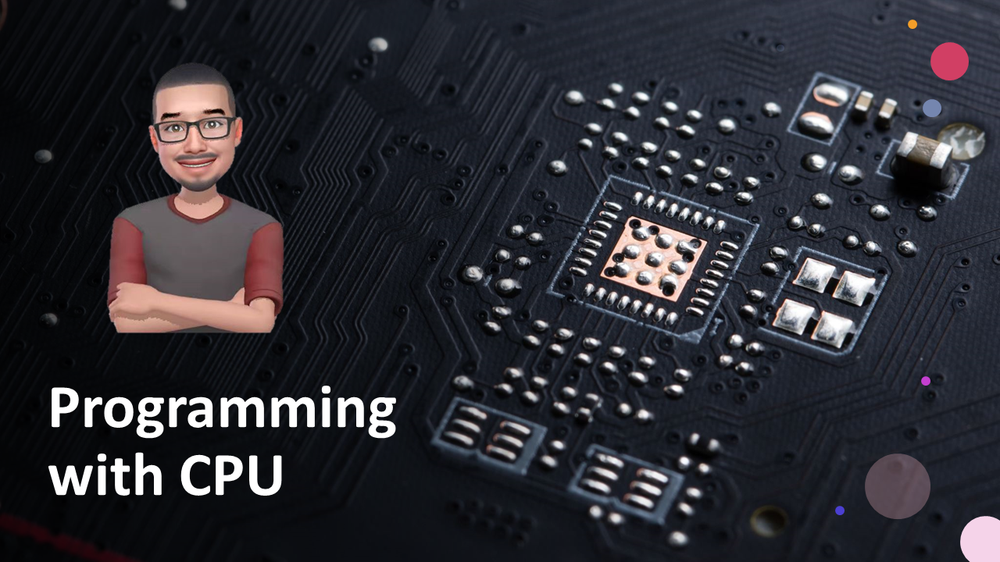
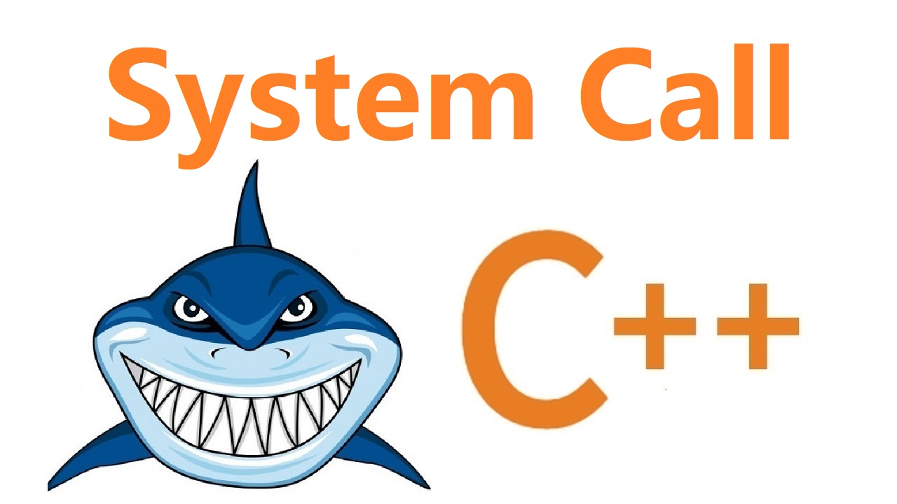

# 歡迎蒞臨：阿布編程

 關注：沒有用的知識 

    

  
  
  
  

## 快速上手
- 👀 在 B 站觀看《CPU眼裏的：編程知識》視頻系列
- 🧪 找到感興趣的話題，上手實驗

## 代碼目錄
<table>
  <tr>
    <td align="center"><a href="source/syscall.s"> <b>CPU眼裏的：系統調用</b></a>
  </tr>
  <tr>
  </tr>
</table>

## 📞社區交流
- 視頻的圖、文版本，可以在：《阿布編程》的公衆號中閲讀
- 遇到問題，可以在《阿布編程》的公衆號中討論
- 微信公衆號：
<table>
  <tr>
    <td align="center"> <b>公众号🔑：阿布编程</b>
  </tr>
</table>
