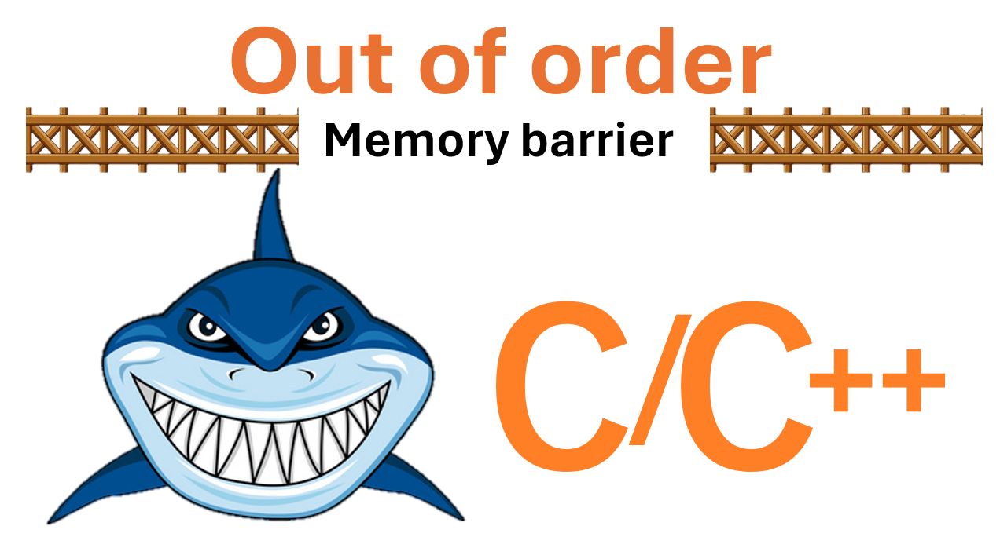
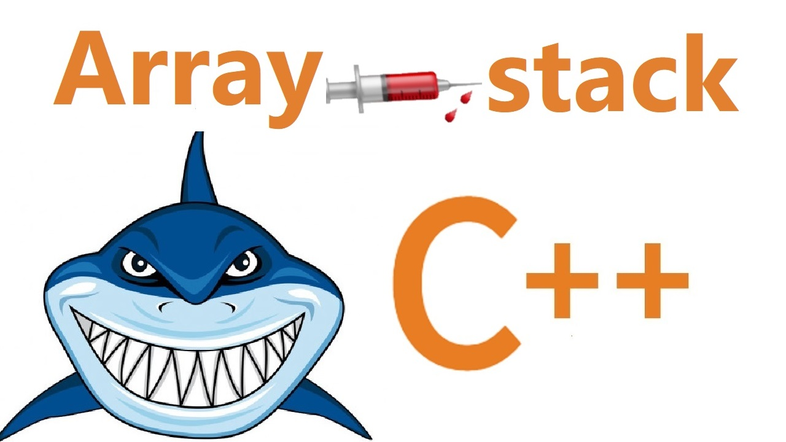
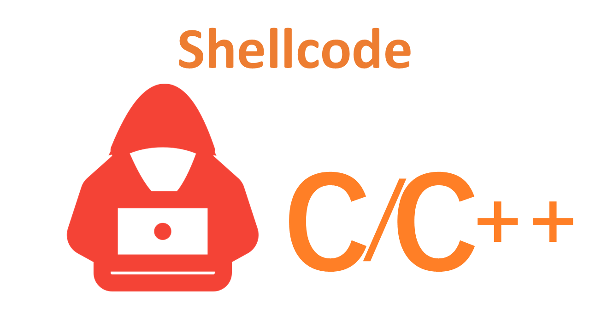
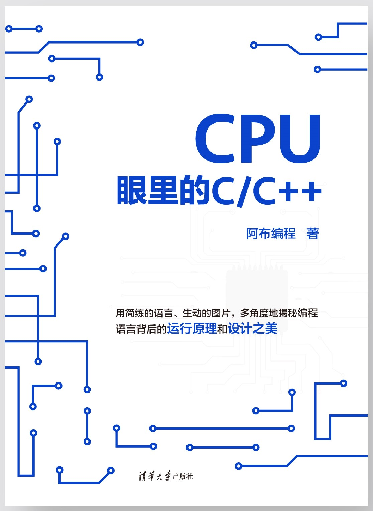
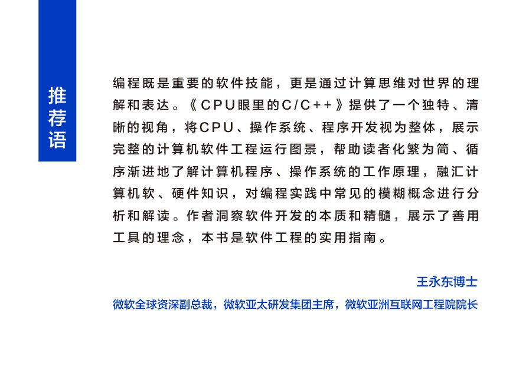

# 歡迎蒞臨：阿布編程

 關注：沒有用的知識 

    

  
  
  
  

## 快速上手
- 👀 在 B 站觀看[《CPU眼裏的：編程知識》](https://space.bilibili.com/261582436)視頻系列
- 🧪 找到感興趣的話題，上手實驗

## 代碼目錄
<table>
  <tr>
    <td align="center"><a href="source/syscall.s"> <b>系統調用</b></a>
    <td align="center"><a href="source/mfence.cpp"> <b>内存屏障</b></a>
    <td align="center"><a href="source/setjmp-longjmp.c"> <b>setjmp/longjmp</b></a>
  </tr>
  <tr>
    <td align="center"><a href="source/cache.c"> <b>缓存</b></a>
    <td align="center"><a href="source/arrayOverflow.c"> <b>数组越界</b></a>
    <td align="center"><a href="source/bsod/bsod.c"> <b>蓝屏</b></a>
  </tr>
  <tr>
    <td align="center"><a href="source/prediction.c"> <b>Atomic</b></a>
    <td align="center"><a href="source/atomic.c"> <b>分支預測</b></a>
    <td align="center"><a href="source/shellcode/injectShellcode.c"> <b>Shellcode</b></a>
  </tr>
  <tr>
    <td align="center"><a href="source/arrayOverflow.c"> <b>数组越界</b></a>
    <td align="center"><a href="source/canary.c"> <b>堆栈里的金丝雀</b></a>
  </tr>
</table>

## 📚實體 + 電子書籍
如果喜歡阿布的講述方式，希望更加系統的學習這些知識，也可以看看阿布的新書《CPU眼裏的C/C++》
<table>
  <tr>
    <td align="center">
    <td align="center">
  </tr>
</table>

掃描二維碼，5折購買或0元試讀電子版

## 📞社區交流
- 視頻的圖、文版本，可以在：《阿布編程》的公衆號中閲讀
- 遇到問題，可以在《阿布編程》的公衆號中討論
- 微信公衆號：
<table>
  <tr>
    <td align="center"> <b>公众号🔑：阿布编程</b>
  </tr>
</table>
